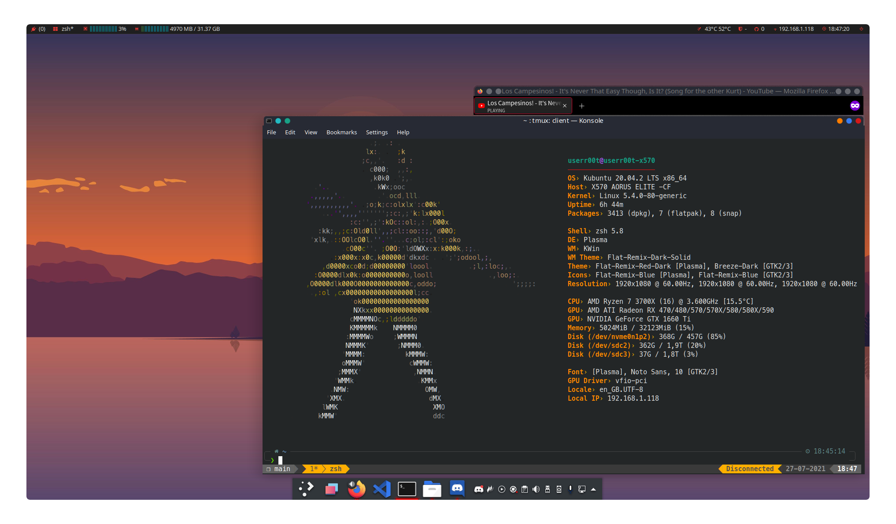

# dotfiles
The dotfiles that keep @UserR00T rolling.

## Note
`.local.*` files are not pushed to git. These are to be provided by yourself, or remove the corresponding code.

## Installation
_This repository is based of [dotbot](https://github.com/anishathalye/dotbot), for various configuration options please visit the dotbot repository._
1. Clone repository
2. Create a `config.sh` based of `config.sh.example`.
3. Run `./install` inside the folder.